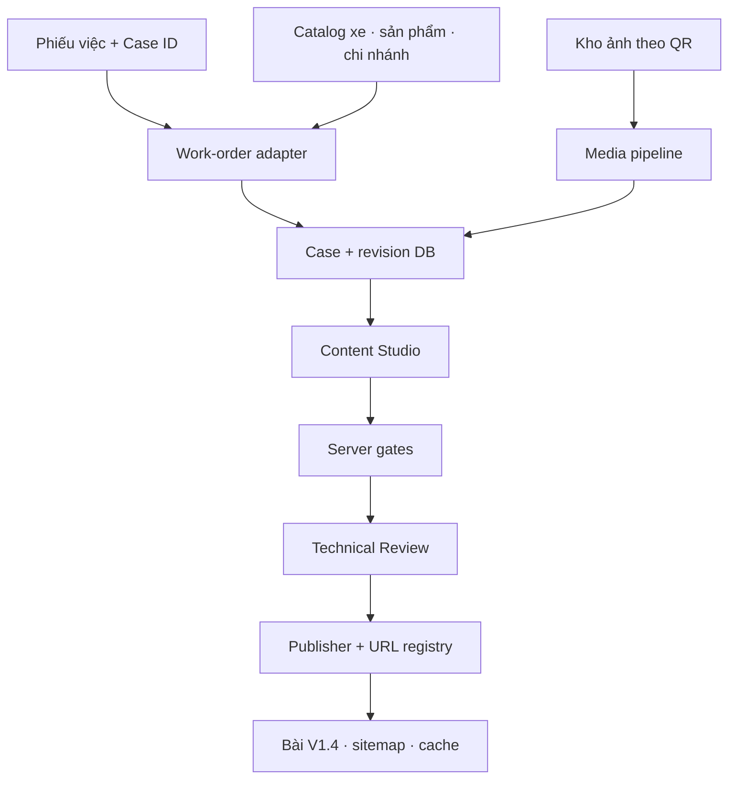

# Architecture — Production Zero‑Rekey

## Một nguồn dữ liệu duy nhất

`CaseRecord`/revision máy chủ là nguồn thật. UI, preview, HTML public, metadata và JSON-LD phải đọc cùng một immutable revision.

## Phân quyền dữ liệu

| Chủ sở hữu | Trường |
|---|---|
| Phiếu việc | Xe, đời/phiên bản, cấu hình lắp, ngày, chi nhánh, kỹ thuật/QC |
| Catalog | Product ref, nguồn, thông số, giá/VAT, bảo hành, URL owner |
| Media | Bytes, checksum, vai trò, ngày, Case ID, quyền dùng, trạng thái xử lý |
| Tài khoản | Tác giả, reviewer assignment, role và branch scope |
| Content | `customerNeed`, `caseNote`, `publishAfterApproval` |
| Reviewer | Quyết định/note gắn đúng revision và technical digest |
| SEO system | H1, title, meta, slug, canonical, schema, links, robots, sitemap |

## Adapter bắt buộc

- `WorkOrderGateway`: đọc ca sẵn sàng, idempotently import một work order.
- `CaseRepository`: revision, optimistic lock, workflow, audit và publish state.
- `MediaGateway`: upload intent, magic-byte validation, checksum, derivatives.
- `GateService`: authoritative source/content/evidence/technical/SEO gates.
- `PublishedRenderer`: cùng renderer cho preview noindex và public snapshot.

Interface nằm tại `server/case-lab-contract.ts`; OpenAPI tại `openapi/case-lab-v2.yaml`.

## Tính nhất quán

- Autosave yêu cầu `If-Match`/expected revision; stale write trả `409 REVISION_CONFLICT`.
- Mọi thay đổi content/technical/media tạo revision mới và làm approval cũ mất hiệu lực.
- Publish reserve URL atomically, chạy lại gate, render immutable snapshot, ghi publication và outbox trong một transaction logic.
- Sitemap/cache/notification đi qua outbox retry; không để lỗi ngoài DB tạo bài nửa chừng.

