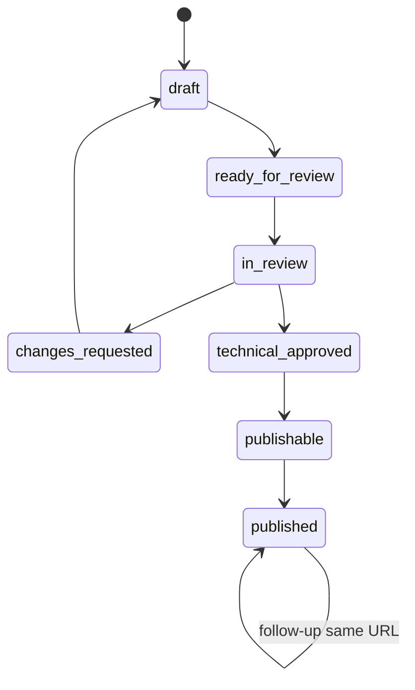

# RBAC & Workflow

## Vai trò

| Role | Quyền |
|---|---|
| `content` | Mở ca theo branch, sửa 2 trường content, xác nhận ảnh, báo dữ liệu sai, gửi duyệt và phản hồi review |
| `oa` | Điều phối case, phân công và phản hồi review trong branch |
| `seo_lead` | Rà soát nội dung/SEO, phân công và phản hồi review trong branch |
| `it` | Rà soát technical snapshot, duyệt hoặc yêu cầu sửa đúng revision được phân công; có thể phản hồi review |
| `boss` | Xem KPI/lịch sử, phản hồi review và quản trị theo mọi branch được cấp quyền |

Role và branch scope phải kiểm tra phía server trên mọi read/write. Mọi vai trò vận hành đều có thể tạo/giải quyết phản hồi trong phạm vi branch; chỉ `oa`, `seo_lead`, `it`, `boss` được quản lý phân công. Tài khoản legacy được ánh xạ server-side: `technical_reviewer` → `it`, `publisher`/`seo_admin` → `seo_lead`, `admin` → `boss`. Không nhận `role`, `technicalApproved`, `gates`, `workflowStatus`, URL hoặc source flags từ client.

## State machine

## Quy tắc revision

- Review chỉ ghi khi actor là reviewer được phân công và `expectedRevision` đúng current revision.
- Approval lưu `revisionId` + `technicalDigest`, không lưu boolean tin cậy trong DTO client.
- Sửa content, dữ liệu kỹ thuật hoặc media sau duyệt tạo revision mới và technical gate trở lại đỏ.
- Submit/review/publish dùng idempotency key; cùng key + cùng body trả lại kết quả cũ.
- Cùng key + body khác trả `409 IDEMPOTENCY_CONFLICT`.

