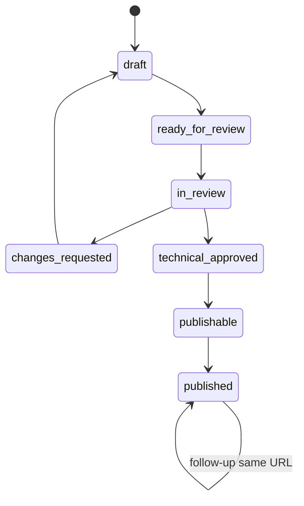

# RBAC & Workflow

## Vai trò

| Role | Quyền |
|---|---|
| `content` | Mở ca theo branch, sửa 2 trường content, xác nhận ảnh, báo dữ liệu sai, gửi duyệt |
| `technical_reviewer` | Đọc technical snapshot/6 ảnh, approve hoặc request changes đúng revision được phân công |
| `publisher` | Publish/schedule/rollback khi policy cho phép |
| `seo_admin` | Quản lý URL owner, intent/link map và giải quyết collision; không duyệt ca thường ngày |
| `admin` | Quản trị role, branch scope và policy; mọi hành động có audit |

Role và branch scope phải kiểm tra phía server trên mọi read/write. Không nhận `role`, `technicalApproved`, `gates`, `workflowStatus`, URL hoặc source flags từ client.

## State machine

## Quy tắc revision

- Review chỉ ghi khi actor là reviewer được phân công và `expectedRevision` đúng current revision.
- Approval lưu `revisionId` + `technicalDigest`, không lưu boolean tin cậy trong DTO client.
- Sửa content, dữ liệu kỹ thuật hoặc media sau duyệt tạo revision mới và technical gate trở lại đỏ.
- Submit/review/publish dùng idempotency key; cùng key + cùng body trả lại kết quả cũ.
- Cùng key + body khác trả `409 IDEMPOTENCY_CONFLICT`.

